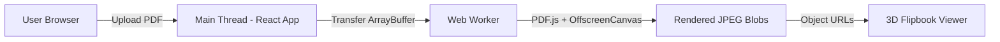
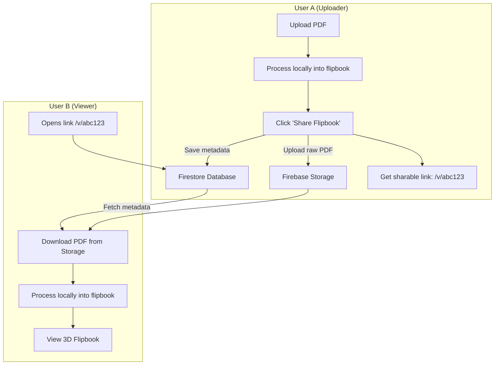

# Aria Flipbook — Product Report

> **Prepared for:** Firebase Project Setup & Service Recommendation  
> **Date:** June 11, 2026  
> **Repository:** [github.com/ART3MIS3151/Pdf-to-Flipbook](https://github.com/ART3MIS3151/Pdf-to-Flipbook)  
> **Live Deployment:** Vercel (Static SPA)

---

## 1. Product Overview

**Aria Flipbook** is a premium interactive web application that allows users to upload PDF documents and experience them as realistic 3D page-turning flipbooks — complete with sound effects, smooth animations, and responsive controls.

The app is currently a **fully client-side** application. All PDF processing happens entirely in the user's browser; no data is sent to any server. We are now expanding the platform to support **cloud storage and sharable links**, enabling users to upload a PDF, generate a unique URL, and share their interactive flipbook with anyone.

### Target Audience
- Students sharing study materials and notes
- Educators distributing course content
- Professionals sharing reports, portfolios, and presentations
- Publishers creating interactive digital catalogs and magazines

---

## 2. Tech Stack

| Layer | Technology | Version |
|---|---|---|
| **Framework** | React | 19.2.6 |
| **Build Tool** | Vite | 8.0.12 |
| **Language** | TypeScript | 6.0.2 |
| **PDF Engine** | Mozilla PDF.js (`pdfjs-dist`) | 5.7.284 |
| **Flipbook Animation** | `react-pageflip` + `page-flip` | 2.0.3 / 2.0.7 |
| **Icons** | Lucide React | 1.17.0 |
| **Analytics** | Vercel Analytics + Speed Insights | 2.0.1 / 2.0.0 |
| **Hosting** | Vercel | Zero-config SPA |
| **Version Control** | Git / GitHub | — |

---

## 3. Architecture

### 3.1 Current Architecture (Client-Side Only)



**Key architectural decisions:**
- **Web Worker rendering:** All PDF parsing and page rendering runs in a dedicated background thread, keeping the UI buttery smooth.
- **OffscreenCanvas:** GPU-accelerated canvas rendering inside the Worker — no DOM access required.
- **Zero-copy data transfer:** PDF binary data is transferred to the Worker using `postMessage` transferable objects, avoiding expensive memory duplication.
- **Blob → ObjectURL pipeline:** Rendered pages are converted to JPEG blobs (quality 0.8), then to ObjectURLs for zero-copy `` rendering.

### 3.2 Planned Architecture (With Firebase)



---

## 4. Features

### 4.1 Core Features (Implemented)
| Feature | Description |
|---|---|
| **PDF Upload** | Drag-and-drop or file browse with MIME validation |
| **3D Page Flipping** | Realistic page-turn animations with shadow effects |
| **Page Flip Sound** | Audio feedback synchronized to flip state machine |
| **Progress Tracking** | Real-time "Rendering page X of Y" progress bar |
| **Page Navigation** | Slider scrubber, prev/next buttons, page counter |
| **Dual Interaction Modes** | "Swipe Mode" (page turning) vs "Pan Mode" (pinch-to-zoom) |
| **Mobile Optimized** | Pull-to-refresh disabled, touch overlay for zoom |
| **Background Processing** | PDF renders in Web Worker — doesn't freeze the UI |
| **Background Tab Support** | OffscreenCanvas + DOM polyfills allow rendering even when tab is inactive |

### 4.2 Planned Features (Requiring Firebase)
| Feature | Firebase Service Needed |
|---|---|
| **Cloud PDF Storage** | Firebase Storage |
| **Sharable Links** | Firestore (metadata) + Storage (file) |
| **Upload History / Library** | Firestore + Firebase Auth |
| **View Count Analytics** | Firestore (increment on view) |
| **Auto-Expiry of Old Uploads** | Cloud Functions (scheduled cleanup) |
| **User Accounts (future)** | Firebase Authentication |

---

## 5. Codebase Summary

### Source Files
| File | Lines | Purpose |
|---|---|---|
| [Flipbook.tsx](file:///d:/Coding/pdf-flipbook/src/Flipbook.tsx) | 170 | Core flipbook viewer, controls, sound, interaction modes |
| [App.css](file:///d:/Coding/pdf-flipbook/src/App.css) | 133 | Component styles, animations, glassmorphism |
| [index.css](file:///d:/Coding/pdf-flipbook/src/index.css) | 102 | Global design system, dark theme, typography |
| [App.tsx](file:///d:/Coding/pdf-flipbook/src/App.tsx) | 98 | Root component, state orchestration, Vercel analytics |
| [pdf-render.worker.ts](file:///d:/Coding/pdf-flipbook/src/pdf-render.worker.ts) | 84 | Web Worker: PDF.js + OffscreenCanvas rendering |
| [PDFUploader.tsx](file:///d:/Coding/pdf-flipbook/src/PDFUploader.tsx) | 72 | Drag-and-drop upload component |
| [PDFLoader.ts](file:///d:/Coding/pdf-flipbook/src/PDFLoader.ts) | 43 | Worker lifecycle bridge, message protocol |
| [main.tsx](file:///d:/Coding/pdf-flipbook/src/main.tsx) | 11 | React entry point |
| **Total** | **~737** | **~21.6 KB of source code** |

### Design System
- **Theme:** Dark mode with deep slate background (`#0f172a`)
- **Typography:** Google Fonts — Inter
- **UI Pattern:** Glassmorphism (frosted glass panels with `backdrop-filter: blur`)
- **Buttons:** Gradient primary, translucent secondary with hover depth effects
- **Animations:** CSS keyframe spinner, scale transforms, gradient text

---

## 6. Infrastructure Requirements

### 6.1 Firebase Services Needed

| Service | Usage | Estimated Scale |
|---|---|---|
| **Firebase Storage** | Store uploaded PDF files | ~1-50 MB per upload |
| **Cloud Firestore** | Store flipbook metadata (ID, filename, timestamp, file size, view count) | ~1 KB per document |
| **Firebase Authentication** | Optional — user accounts for upload history | Email/Google sign-in |
| **Cloud Functions** | Optional — scheduled cleanup of expired uploads, DMCA enforcement | Lightweight cron jobs |
| **Firebase Hosting** | Not needed — app is hosted on Vercel | — |

### 6.2 Firestore Data Model

```
flipbooks (collection)
  └── {flipbookId} (document)
        ├── id: string (UUID)
        ├── fileName: string
        ├── fileSize: number (bytes)
        ├── storagePath: string ("uploads/{id}.pdf")
        ├── createdAt: timestamp
        ├── viewCount: number
        └── expiresAt: timestamp (optional, for auto-cleanup)
```

### 6.3 Firebase Storage Structure

```
uploads/
  ├── abc123.pdf
  ├── def456.pdf
  └── ...
```

### 6.4 Security Rules Needed
- **Storage:** Allow unauthenticated writes (for anonymous uploads), restrict file size (e.g., max 50 MB), allow only `application/pdf` content type.
- **Firestore:** Allow unauthenticated reads (for shared links), restrict writes to new documents only (no overwriting).

---

## 7. Legal & Compliance Pages (Planned)

Since the app will store user-generated content, the following legal pages will be implemented:

| Page | Purpose |
|---|---|
| **Privacy Policy** | GDPR/CCPA-compliant disclosure of data collection, storage, and user rights |
| **Terms of Service** | Acceptable use, limitation of liability, indemnification, content ownership |
| **DMCA Policy** | Copyright takedown procedure for user-uploaded content |

---

## 8. Performance Characteristics

| Metric | Value |
|---|---|
| **Bundle Size** | Lightweight (Vite tree-shaken) |
| **PDF Processing** | Off-main-thread (Web Worker) |
| **Render Quality** | 1.5x scale, JPEG at 80% quality |
| **Memory Strategy** | Zero-copy ArrayBuffer transfer + Blob ObjectURLs |
| **Tab Behavior** | Continues rendering in background tabs (OffscreenCanvas) |
| **Mobile Support** | Dual interaction modes, pull-to-refresh disabled |

---

## 9. Deployment Pipeline

```
Local Development (Vite dev server)
    ↓ git push
GitHub (main branch)
    ↓ auto-deploy
Vercel (Production SPA)
    ↓ connects to
Firebase (Storage + Firestore) ← NEW
```

---

> [!NOTE]
> This report reflects the current state of the application as of June 11, 2026.  
> The Firebase integration is pending the user's `firebaseConfig` credentials to begin implementation.
